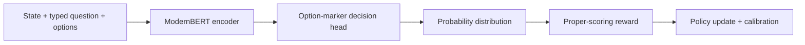

# Decision Models

A generative model predicts tokens from an open vocabulary. A typed decision
model predicts inside an output space supplied by the application. It returns
probabilities that code can inspect directly instead of prose that must be
parsed.

## Three primitives

The Jev-compatible interface used by Laya exposes three question types:

- **choice** selects one label and returns a probability for every label;
- **score** predicts an ordered level distribution and its expected value;
- **noul** returns $P(\text{true})$ for a binary proposition.

Typed output prevents malformed labels. It does not prevent incorrect
judgments. Reliability still depends on accuracy, calibration, domain coverage,
and a sensible escalation policy.

## What is public

TypeSafe publicly describes Jev as a System One model for fast structured
decisions, but has not published its internal architecture, weights, or complete
RLCD training recipe.

Laya is an independent open implementation. Its English checkpoint uses a
ModernBERT-large backbone plus a decision head. Its source publishes sequence
formatting, option scoring, a training notebook, and calibration behavior. The
following pages study that verifiable implementation.

!!! note "A name is not an algorithm specification"

    “Reinforcement Learning for Calibrated Decisions” describes a goal. Unless
    a lab publishes the exact policy, reward, data, optimizer, and evaluation,
    another implementation should not be presented as an exact reproduction.

## The learning bridge

ModernBERT explains how to encode a state and question bidirectionally. Laya
adds candidate markers and a scalar scorer. RLCD then trains the resulting
option distribution, and temperature scaling repairs held-out calibration.

---

# 中文版本

生成模型在开放词表中预测 token。typed decision model 则在应用预先给定的输出空间中
预测，直接返回代码可以检查的概率，而不是需要解析的自由文本。

## 三种 primitive

Laya 使用的 Jev-compatible interface 提供三种 question type：

- **choice** 选择一个 label，并返回每个 label 的概率；
- **score** 预测有序等级分布及其期望值；
- **noul** 对二元命题返回 $P(\text{true})$。

typed output 可以阻止格式错误或 schema 外的 label，但不能阻止判断错误。可靠性仍取决于
accuracy、calibration、domain coverage 和合理的 escalation policy。

## 哪些内容是公开的

TypeSafe 把 Jev 描述为用于快速结构化决策的 System One model，但没有公开内部架构、
权重或完整 RLCD training recipe。

Laya 是独立开源实现。其英文 checkpoint 使用 ModernBERT-large backbone 加 decision
head，并公开 sequence format、option scoring、training notebook 与 calibration 行为。
后续页面只研究这些可以验证的实现。

!!! note "名称不是算法规格"

    “Reinforcement Learning for Calibrated Decisions”描述的是目标。除非模型提供方公开
    完整 policy、reward、data、optimizer 与 evaluation，另一份实现不能被称为精确复现。

## 学习桥梁

ModernBERT 解释怎样双向编码 state 与 question；Laya 加入 candidate marker 与 scalar
scorer；RLCD 训练得到的 option distribution，temperature scaling 再修复独立数据上的
calibration。完整流程见英文部分的数据流图。
