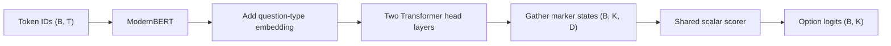

# Laya Decision Head

This page follows Laya's public `build_sequence` and `DecisionModel` source. It
explains how a bidirectional encoder becomes a non-generative option scorer.

## Sequence construction

Laya builds one sequence per question:

```text
[CLS]
<question type> question: <instructions>
[SEP]
[MASK] option 0
[MASK] option 1
...
[SEP]
<shared state>
[SEP]
```

The `[MASK]` tokens are option markers here. They are not hidden words for an
MLM objective. Because the encoder is bidirectional, each marker representation
can use the instructions, all candidate descriptions, and the state.

A call with several questions creates several sequences and evaluates them in
one batch. “One forward pass” means one batched model call, not one sequence
that combines unrelated questions.

## Head architecture

Let the encoder output be $H_{B\times T\times d_{model}}$. Laya adds a learned
embedding for the question type to every token, then applies two additional
Pre-LayerNorm Transformer encoder layers.

The marker indices gather $K$ candidate representations:

$$
M_{B\times K\times d_{model}}
=\operatorname{gather}(H,\text{marker positions}).
$$

Each candidate receives one scalar score:

$$
z_i=W_2\operatorname{GELU}(W_1\operatorname{LN}(M_i)).
$$

Candidates are padded across a batch. `marker_mask` sets nonexistent candidate
logits to a large negative number before softmax.



## One distribution, three outputs

With temperature $T_{cal}>0$:

$$
p_i=\frac{\exp(z_i/T_{cal})}{\sum_j\exp(z_j/T_{cal})}.
$$

For choice, the answer is $\arg\max_i p_i$. For ordered score levels
$0,\ldots,K-1$, the fractional output is:

$$
\operatorname{score}=\sum_{i=0}^{K-1}i\,p_i.
$$

Noul always has `[false, true]` candidates and returns $p_{true}$.

The architecture is non-autoregressive. It has no decoder loop, token sampler,
or KV cache. All option logits are produced in parallel.

## Context budgeting

Question text and candidate descriptions consume the beginning of the context
window. The remaining budget belongs to state. With many long options, each
description may be truncated and less state may be visible. This is a modeling
constraint, not an API detail.

The remedy may be a larger context window, shorter and more distinct candidate
descriptions, hierarchical decisions, or retrieval-based shortlisting. A
shortlist changes probabilities to be conditional on the retained candidates,
so thresholds must be evaluated again.

## Hands-on

Read [`modernbert_notes/decision.py`](https://github.com/Alwin-Yang/ModernBERT-Notes/blob/main/modernbert_notes/decision.py)
next to Laya's public `laya/common.py`. The local test constructs marker
positions directly so that the decision mathematics can be learned without
downloading a tokenizer or checkpoint.

---

# 中文版本

本页依据 Laya 公开的 `build_sequence` 和 `DecisionModel` 源码，解释双向 encoder
怎样变成不生成文本的 option scorer。

## Sequence construction

Laya 为每个 question 构造一条 sequence，具体格式见英文部分的代码块。这里的
`[MASK]` 是 option marker，不是 MLM objective 中被遮蔽的词。encoder 是双向的，
所以每个 marker representation 都能读取 instructions、所有 candidate description
和 state。

一次调用若包含多个 question，会构造多条 sequence，再放进一个 batch 中计算。“一次
forward pass”表示一次 batched model call，不表示把无关 question 合并进同一条 sequence。

## Head architecture

记 encoder output 为 $H_{B\times T\times d_{model}}$。Laya 把 learned question-type
embedding 加到每个 token 上，再通过两个额外的 Pre-LayerNorm Transformer encoder
layer。

marker index gather 出 $K$ 个 candidate representation：

$$
M_{B\times K\times d_{model}}
=\operatorname{gather}(H,\text{marker positions}).
$$

每个 candidate 得到一个 scalar score：

$$
z_i=W_2\operatorname{GELU}(W_1\operatorname{LN}(M_i)).
$$

batch 中 option 数不同时要补齐，`marker_mask` 会在 softmax 前把不存在的 candidate
logit 设为很大的负数。完整数据流见英文部分的 Mermaid 图。

## 一套 distribution，三种输出

使用 temperature $T_{cal}>0$：

$$
p_i=\frac{\exp(z_i/T_{cal})}{\sum_j\exp(z_j/T_{cal})}.
$$

choice 返回 $\arg\max_i p_i$。对有序 score level $0,\ldots,K-1$，连续输出为：

$$
\operatorname{score}=\sum_{i=0}^{K-1}i\,p_i.
$$

noul 固定使用 `[false, true]` 两个 candidate，并返回 $p_{true}$。

这个架构是 non-autoregressive 的：没有 decoder loop、token sampler 或 KV cache，所有
option logit 并行产生。

## Context budget

question text 与 candidate description 会占用 context window 的前半部分，剩余预算才
属于 state。candidate 很多或描述很长时，option 会被截断，state 的可见内容也会减少。
这属于建模约束，而不只是 API 细节。

可以扩大 context、缩短并区分 candidate description、使用层级决策或 retrieval
shortlist。shortlist 之后的概率是以保留候选为条件的概率，因此 threshold 需要重新评估。

## 动手实现

把 [`modernbert_notes/decision.py`](https://github.com/Alwin-Yang/ModernBERT-Notes/blob/main/modernbert_notes/decision.py)
与 Laya 的 `laya/common.py` 对照阅读。本地测试直接构造 marker position，因此无需下载
tokenizer 或 checkpoint 就能学习 decision mathematics。
