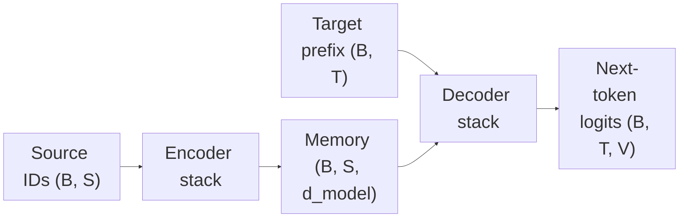

# BERT

ModernBERT keeps BERT's objective: one encoder reads a whole sequence and
predicts masked tokens. This page defines that encoder. Later pages replace
its 2018 blocks.

Let batch size be $B$, source length be $S$, sequence length be $T$, hidden
width be $d_{model}$, vocabulary size be $V$, layer count be $N$, head count
be $H$, and per-head width be $d_k=d_{model}/H$.

## The 2017 Transformer has two stacks

Vaswani et al. designed a sequence-to-sequence model for translation. The
source sentence is fully known, so one stack can read all of it. The target
sentence is produced one token at a time, so a second stack reads only the
prefix already written and looks up the source representation.



An encoder layer has two sublayers. Self-attention lets every source position
use every other source position. A feed-forward network then transforms each
position on its own. The stack's output is a memory tensor of shape
$(B, S, d_{model})$.

A decoder layer has three sublayers:

1. causal self-attention over the target prefix;
2. cross-attention, whose queries come from the decoder state and whose keys
   and values come from the encoder memory;
3. a position-wise feed-forward network.

Causal self-attention puts $-\infty$ in the mask wherever a query would read a
future target position. The model can then be trained with teacher forcing and
still match left-to-right generation.

## BERT keeps the encoder stack

Devlin et al. train $N$ encoder layers on raw text. The published model has no
decoder stack and no cross-attention. Token ids of shape $(B, T)$ become one
vector per position:

```text
token ids (B, T)
  + segment ids (B, T)
  + position ids (B, T)
-> sum of three embeddings
(B, T, d_model)
-> N encoder layers
(B, T, d_model)
```

Each input vector is the sum of a token embedding, a segment embedding, and a
learned absolute position embedding. The segment id marks whether a token
belongs to sentence A or sentence B when two spans are packed into one
sequence. BERT-base uses $N=12$, $d_{model}=768$, and $H=12$. BERT-large uses
$N=24$, $d_{model}=1024$, and $H=16$. The released checkpoints use a maximum
length of 512.

One BERT layer follows the 2017 post-norm order. Attention runs on $X$, the
residual sum is normalized, then the same pattern is applied to the
feed-forward network:

$$
\begin{aligned}
H &= \operatorname{LayerNorm}(X + \operatorname{Attention}(X)), \\
Y &= \operatorname{LayerNorm}(H + \operatorname{FFN}(H)).
\end{aligned}
$$

Scaled dot-product attention is the same operation as in the 2017 encoder:

$$
A = \operatorname{softmax}\left(
  \frac{QK^\top}{\sqrt{d_k}} + M
\right), \qquad O = AV.
$$

For real tokens, $M_{ij}=0$. Padding positions receive $-\infty$. A query at
position $i$ may therefore use keys on both sides.

## Why the objective is masked language modeling

Bidirectional attention and next-token prediction conflict. If every position
could see the tokens to its right, the label at that position would already be
visible in the input. BERT removes that leak by hiding part of the input and
asking the hidden state at the same index to recover the original id.

The paper's corruption procedure is:

- select 15% of token positions;
- among those positions, replace 80% with the special token `[MASK]`, replace
  10% with a random vocabulary id, and leave 10% unchanged;
- the label is the original token id at each selected position.

Unselected positions are ignored by the loss. One forward pass scores every
selected position, because each position already has its context. There is no
left-to-right generation loop.

The 80/10/10 split exists because fine-tuning inputs do not contain `[MASK]`.
Training on some unchanged and randomly replaced tokens forces the encoder to
build a usable representation when that symbol is absent.

The output head classifies the hidden state at each selected position. In the
released BERT checkpoint that head first applies a position-wise transform — a
linear layer, GELU, and LayerNorm — then multiplies by the input embedding
matrix $E_{V\times d_{model}}$ and adds a vocabulary bias. The result is a
logit vector of width $V$. The head does not attend to a separate memory
tensor.

This repository's teaching head keeps only the tied map. With hidden states
$H_{B\times T\times d_{model}}$,

$$
Z_{B\times T\times V} = HE^\top + b.
$$

Every selected position is still scored in one forward pass.

BERT also trains the `[CLS]` vector with next sentence prediction: the two
packed spans are either a true consecutive pair or a random pair, and a
classifier on `[CLS]` predicts which. That auxiliary loss is separate from the
masked-token loss.

## Three uses of the same blocks

The 2017 blocks were later trained in three layouts. The layout decides which
positions a token may read, and that choice decides the loss.

| Layout | Stacks | What each token may read | Training signal |
|---|---|---|---|
| BERT | encoder | the whole packed sequence, except padding | masked tokens, plus next sentence prediction |
| GPT | decoder, with cross-attention removed | the current token and positions to its left | the next token |
| T5, BART | encoder and decoder | encoder: the corrupted source; decoder: the target prefix and the encoder memory | reconstruct or continue the target |

BERT's layout is the one ModernBERT keeps: a bidirectional encoder trained to
fill masked positions, then reused for classification, retrieval, and token
labeling. The [architecture](architecture.md) page derives the blocks that
replace this 2018 layer.

---

# 中文版本

ModernBERT 保留 BERT 的目标：一个 encoder 读完整段序列，并预测被 mask 的
token。本页定义这个 encoder。后续页面会替换它在 2018 年使用的 block。

符号与英文部分相同：$B$ 是 batch size，$S$ 是 source 长度，$T$ 是序列长度，
$d_{model}$ 是隐藏维度，$V$ 是词表大小，$N$ 是层数，$H$ 是 head 数，
$d_k=d_{model}/H$。

## 2017 年的 Transformer 有两叠层

Vaswani 等人的模型面向翻译。source 整句已知，所以一叠层可以读完它。target
要逐个 token 写出来，所以另一叠层只读已经写出的前缀，并查阅 source 的表示。

上面的数据流图对应这条路径。encoder 的输出是 memory，形状为
$(B, S, d_{model})$。

encoder layer 有两个子层。self-attention 让每个 source 位置使用所有其他
source 位置，feed-forward network 再按位置独立变换。

decoder layer 有三个子层：

1. 对 target 前缀做 causal self-attention；
2. cross-attention：query 来自 decoder 状态，key 和 value 来自 encoder memory；
3. 按位置计算的 feed-forward network。

causal self-attention 在 query 会读到未来 target 位置时，把 mask 设为
$-\infty$。这样训练可以用 teacher forcing，同时与从左到右的生成一致。

## BERT 保留 encoder 这一叠

Devlin 等人用原始文本训练 $N$ 层 encoder。论文中的模型没有 decoder stack，也
没有 cross-attention。形状为 $(B, T)$ 的 token id 变成每个位置一个向量：

```text
token ids (B, T)
  + segment ids (B, T)
  + position ids (B, T)
-> 三个 embedding 相加
(B, T, d_model)
-> N 层 encoder
(B, T, d_model)
```

每个输入向量是 token embedding、segment embedding 和学习式绝对 position
embedding 之和。两段文本拼进同一序列时，segment id 标记 token 属于句子 A 还是
句子 B。BERT-base 使用 $N=12$、$d_{model}=768$、$H=12$。BERT-large 使用
$N=24$、$d_{model}=1024$、$H=16$。发布的 checkpoint 最大长度为 512。

一个 BERT layer 沿用 2017 年的 post-norm 顺序。attention 作用在 $X$ 上，残差和
先做 LayerNorm，feed-forward network 再重复同一模式：

$$
\begin{aligned}
H &= \operatorname{LayerNorm}(X + \operatorname{Attention}(X)), \\
Y &= \operatorname{LayerNorm}(H + \operatorname{FFN}(H)).
\end{aligned}
$$

scaled dot-product attention 与 2017 年 encoder 中的运算相同：

$$
A = \operatorname{softmax}\left(
  \frac{QK^\top}{\sqrt{d_k}} + M
\right), \qquad O = AV.
$$

真实 token 的 $M_{ij}=0$，padding 位置为 $-\infty$。位置 $i$ 的 query 因此可以
使用两侧的 key。

## 为什么目标是 masked language modeling

双向 attention 与 next-token prediction 不能同时成立。若每个位置都能看到右侧
token，该位置的 label 已经出现在输入里。BERT 把输入的一部分藏起来，让同一
下标的 hidden state 恢复原来的 id，从而去掉这条泄漏。

论文中的破坏方式是：

- 选出 15% 的 token 位置；
- 在这些位置中，80% 换成特殊 token `[MASK]`，10% 换成随机词表 id，10% 保持不变；
- label 是每个被选位置上原来的 token id。

未被选中的位置不进入 loss。每个位置在一次前向里已经带有自己的上下文，所以同
一次前向可以为所有被选位置打分。这里没有从左到右的生成循环。

80/10/10 的划分是因为 fine-tuning 的输入里没有 `[MASK]`。对一部分保持原样和被
随机替换的 token 也计算损失，encoder 在没有这个符号时仍要给出可用表示。

输出头把每个被选位置的 hidden state 分类到词表上。发布的 BERT checkpoint
里，这个头先做按位置的 transform（linear、GELU、LayerNorm），再乘以输入
embedding 矩阵 $E_{V\times d_{model}}$ 并加上词表 bias。结果是宽度为 $V$ 的
logit 向量。这个头不会对另一份 memory 做 attention。

本仓库的教学 head 只保留绑定映射。设 hidden state 为
$H_{B\times T\times d_{model}}$，则

$$
Z_{B\times T\times V} = HE^\top + b.
$$

所有被选位置仍然在一次前向中打分。

BERT 还用 next sentence prediction 训练 `[CLS]` 向量：拼在一起的两段要么真的
相邻，要么随机配对，`[CLS]` 上的 classifier 预测属于哪一种。这项辅助损失与
masked-token loss 分开计算。

## 同一套 block 的三种用法

2017 年的 block 后来按三种布局训练。布局决定一个 token 可以读哪些位置，这个
选择又决定损失怎么写。

| 布局 | 层叠 | 每个 token 可以读什么 | 训练信号 |
|---|---|---|---|
| BERT | encoder | 除 padding 外的整段打包序列 | masked token，外加 next sentence prediction |
| GPT | 去掉 cross-attention 的 decoder | 当前 token 及其左侧位置 | 下一个 token |
| T5、BART | encoder 与 decoder | encoder 读被破坏的 source；decoder 读 target 前缀和 encoder memory | 重建或续写 target |

BERT 的布局就是 ModernBERT 保留的布局：双向 encoder 先学习填回被 mask 的位置，
再用于分类、检索和 token labeling。[架构](architecture.md)页推导替换这一
2018 年 layer 的 block。
