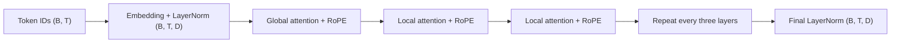

# ModernBERT Overview

ModernBERT keeps BERT's encoder-only, bidirectional objective and replaces its
2018-era blocks with components proven in modern language models. It is built
for classification, retrieval, token labeling, and masked language modeling,
not autoregressive text generation.

## The architecture at a glance

The main changes are:

- rotary positional embeddings (RoPE) instead of learned absolute positions;
- global attention every third layer and local sliding-window attention in the
  other layers;
- Pre-LayerNorm residual blocks;
- GeGLU feed-forward layers;
- bias-free projections and normalization;
- unpadding plus FlashAttention for efficient execution.

The next pages derive each change and connect it to the implementation.

---

# 中文版本

ModernBERT 保留 BERT 的 encoder-only 双向目标，同时把 2018 年的 block 换成现代
语言模型中已经验证过的组件。它面向分类、检索、token labeling 和 masked language
modeling，而不是 autoregressive 文本生成。

## 架构总览

上面的数据流图展示了主干。主要变化包括：

- 用 rotary positional embeddings（RoPE）替代学习式绝对位置编码；
- 每三层使用一次 global attention，其余层使用 local sliding-window attention；
- 使用 Pre-LayerNorm 残差结构；
- 使用 GeGLU feed-forward layer；
- projection 与 normalization 默认不使用 bias；
- 通过 unpadding 和 FlashAttention 提高执行效率。

后续页面会推导每一项变化，并与代码实现对应起来。
